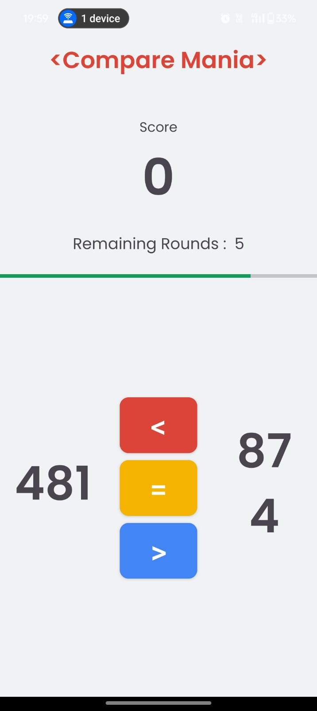

# 🔢 Compare_Mania

Compare_Mania is a **fun and minimal Android game** developed during a **3-day Android workshop by GDSC NIT Hamirpur**. The game challenges users to **compare two numbers** and helps track their **score based on correct selections**. It's a great beginner-friendly project to understand Android development basics like UI design, logic building, and score tracking.

## 📱 Features
- Simple number comparison game
- Score updates based on correct answers
- Minimal and clean UI
- Lightweight and responsive app
- Great for Android development practice

## 🏫 Workshop Info
📍 _Built during the 3-Day Android Workshop conducted by GDSC NIT Hamirpur_  
👩‍💻 _Perfect beginner-friendly app to get hands-on with Android Development basics_

## 📸 Screenshots

<p align="center">
   
   
  
</p>

## 💡 How to Run
1. Clone the repository  
   ```bash
   git clone https://github.com/Anuja1227/Compare_Mania.git
